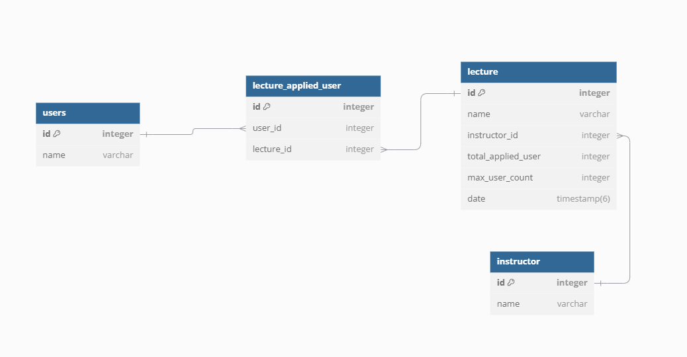

# hhp_2weeks
 
# ERD

# ERD 설계의 이유
1. 이번 과제의 목적은 강의 신청 및 강의 정보를 관리 하는데 중점을 둔다고 생각하여, 유저 테이블과 강사 테이블은 확장성을 고려하여 최소한의 정보만 넣기로 했습니다.   

2. 신청한 유저 정보의 경우 하나의 강의 ID에 여러 유저 정보가 들어가기 때문에, 강의 ID를 외래키로 하는 강의 신청한 유저 테이블에 따로 저장 했다.  
현재 신청한 유저 수를 컬럼으로 따로 관리 하는 이유는 락 범위를 줄이기 위함이다.  
만약 강의 신청 유저 테이블에 해당 강의 ID로 COUNT 했을때, 테이블 전체에 락을 걸지 않는 이상 업데이트 되는 데이터를 막을 수 없어 동시성 문제가 발생할 가능성이 생긴다.  
하지만 따로 강의 테이블에서 이 수치를 관리하게 되면, 해당 강의 로우에만 락이 걸리기 때문에 데이터가 추가 되면서 생기는 문제나 해당 강의 외에 다른 강의에 불필요하게 락이 걸리는 경우를 방지 할 수 있다.

